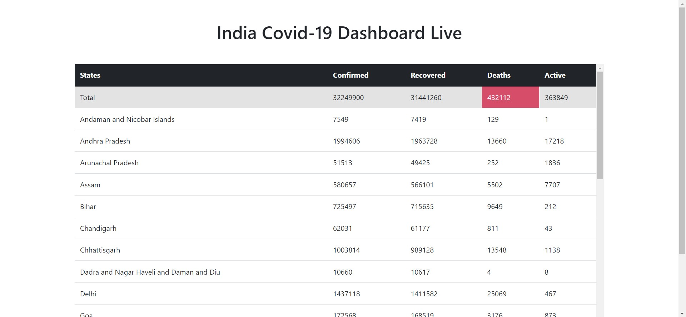
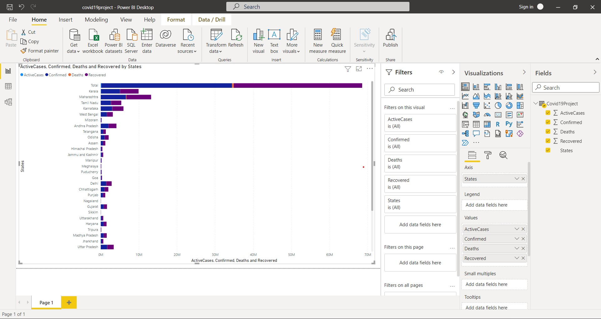
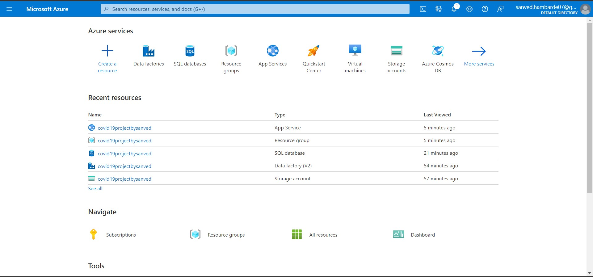

# Covid19-Project
A Covid-19 Project which shows live data of Covid-19 cases in India hosted on Azure Cloud.
Data Visualization in Power BI.
Azure Services used for the project are Azure App Services, Azure Data Factory, Azure Blob Storage, Azure SQL Database, Power BI.
Project link https://covid19projectbysanved.azurewebsites.net/

